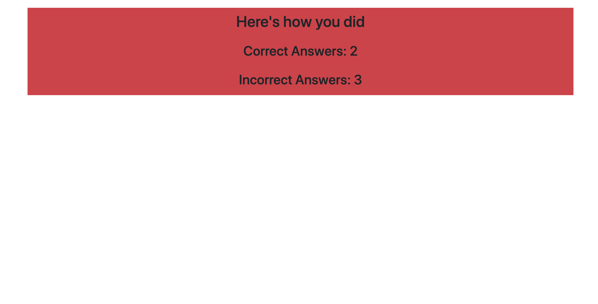
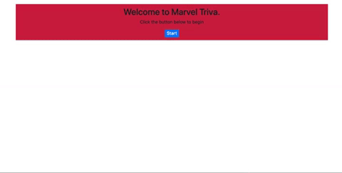

# TriviaGame

## Game Function
This simple game makes use of JavaScript's setInterval timer function. 

Users are given 60 seconds total to correctly guess the answer all the trivia questions. 

Upon finishing the quiz, users can hit the submit button to see how many questions the answered correctly. 

Should 60 pass before the user hits the submit button, the quiz answers will automatically be submitted. Any unanswere questions will be counted as incorrect answers. 

See an example of typical gameplay below.

